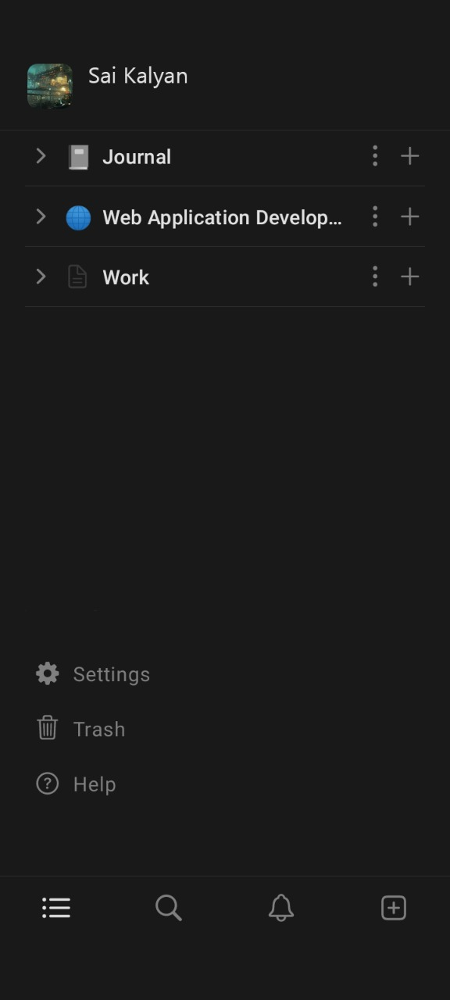
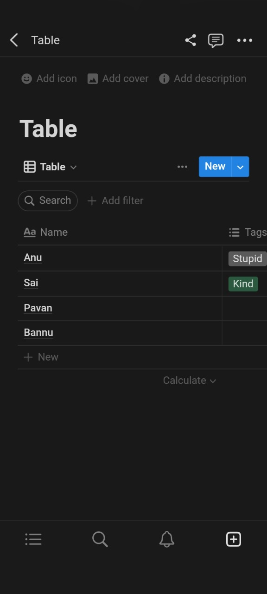
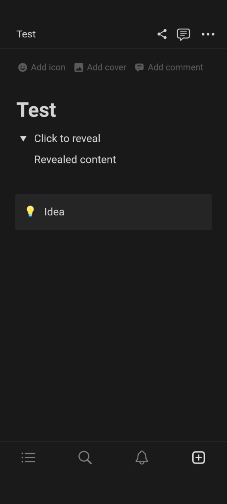
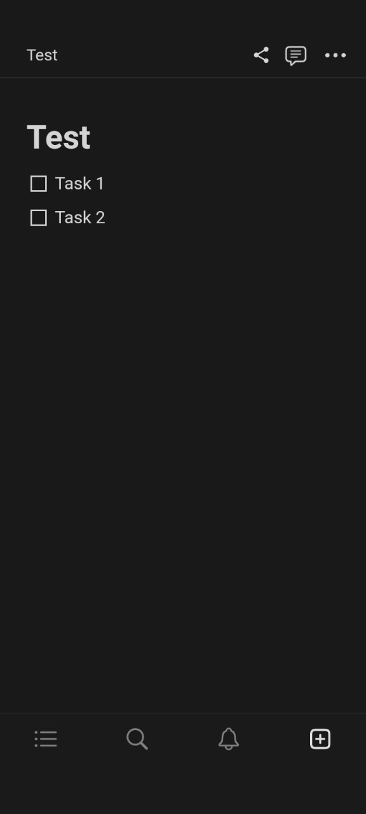

# Android Dev
Sai Kalyana Raman(U24553100)\
Shatrugna Rao Korukanti(U43517028)

---

## Overview

Our project is to build an utility android app. It is similar to the present day [Notion app](https://play.google.com/store/apps/details?id=notion.id). We aim to provide tools in assisting document generation and also integrate with google drive storage medium. We also plan to integrate live collaboration, p2p video and voice chat and workspace sharing. The app will be using markdown markup language to dynamically generate ui elements and for easy storage of the user document.

---

## Related Work

It is simlar to Notion app, and has few unique features. One which is integrating with Gdrive, and p2p video and voice chat. There could be a downgrade in the visual elements due to material design constraint in android.

---

## Requirement Analysis and Testing 

*(This section should clearly describe all features/requirements that you plan to implement or have implemented for your application. You should separate them into three categories: essential, desirable and optional.
 
|Title  |View project details (Essential)| View project details (Desirable) | View project details (Optional)
|---|---|---|---|
|Description|  Our project is to build an utility android app similar to [Notion app](https://play.google.com/store/apps/details?id=notion.id). We aim to provide tools in assisting document generation and also integrate with google drive storage medium.  | Additionally, We plan to integrate live collaboration, p2p video and voice chat and workspace sharing as desirable options. | The app can also have markdown markup language to dynamically generate ui elements and also for easy storage of the user document. |
|Mockups| <table><thead><tr><th>sample_main</th><th>sample_page1</th></tr></thead><tbody><tr><td></td><td></td></tr><tr><td></td><td></td></tr></tbody></table>|
|Acceptance Tests| UI components dynamic creation and data Retention of notion app in GDrive. | Testing of p2p networking, voice chat and live collaboration | markdown parser development|
|Test Results| |
|Status| |
    
---

## Timeline

|Iteration | Application Requirements | Android Components and Features| member 1 contribution/tasks| member 2 contribution/tasks|
|---|---|---|---|---|
|1| <table><thead><tr><th>Essential</th><th>Desirable</th><th>Optional</th></tr></thead><tbody><tr><td>App Layout UI tools development</td><td>Complex UI development  such as table and kanban board</td><td>Hyperlinks and image ui integration.</td></tbody></table> | Jetpack Compose| Design and implement app layout| Functional Implementation of components| |
|2|<table><thead><tr><th>Essential</th><th>Desirable</th><th>Optional</th></tr></thead><tbody><tr><td>Serialization of UI data and integrating gdrive api.</td><td>Integrating voice and video chat using webrtc protocol.</td><td>serialization of data in the form of markdown markup language.</td></tbody></table> | Google Drive Kotlin APIs'| GDrive Integration| P2P Networking implementation|
|3|<table><thead><tr><th>Essential</th><th>Desirable</th><th>Optional</th></tr></thead><tbody><tr><td>Unit testing of functional components and gdrive api.</td><td>Live collaboration of the document with invited friends.</td><td>None</td></tbody></table> | JUNIT and UI Testing | JUNIT test cases and live Testing of the app | Live Collaboration feature implementation|

## References

[Notion app](https://play.google.com/store/apps/details?id=notion.id)
